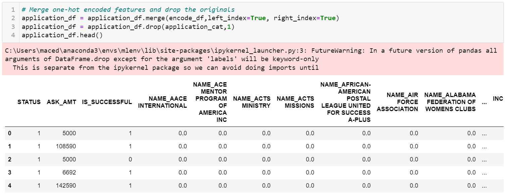
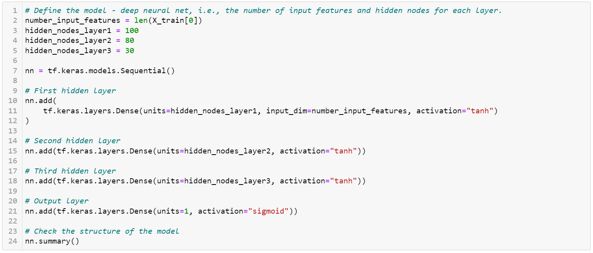
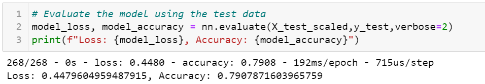

# Neural_Network_Charity_Analysis
Neural Networks and Deep Learning Models

## Overview of the Analysis
Neural Networks and Deep Learning Models were used to create a binary classification to help a charity organization predict whether applicants will be successful should they receive funds.

## Results
- **Data Processing**
    - The target variable is the "IS_SUCCESSFUL" column.
    - The variables considered to be features are STATUS, NAME, ASK_AMT, APPLICATION_TYPE, INCOME_AMT, SPECIAL_CONSIDERATIONS_N, and SPECIAL_CONSIDERATIONS_Y.
    - The variables that were neither targets nor variables were EIN and NAME. However, keeping the NAME column and binning seemed to help achieve favorable results.
    

- **Compiling, Training, and Evaluating the Model**
    - There are a total of three hidden layers. The first layer contains 100 neurons, second layer has 80  neurons, and the third layer has 30 neurons. The activation function used for the hidden layer is tanh. The activation function for the output layer is sigmoid. The reason for using this strategy is due to experimenting with the number or neurons, layers, and activation functions until the desired outcome was reached.
    
    - I was able to achieve the target performance at an accuracy of 79%.
    

## Summary
After optimizing the model, a final accuracy score of 79% was achieved. I would recommend keeping the NAME column and using the binning process, adding more neurons and layers, and finally, changing the activation function for the hidden layers to tanh.